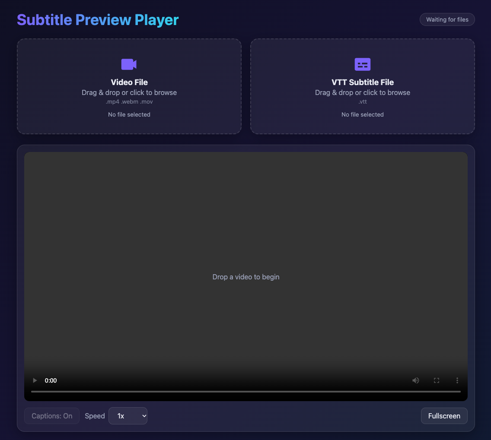

# Subtitle Preview Player

A modern, lightweight web application for previewing local videos with WebVTT subtitles.

## Features

- Drag-and-drop video files
  - MP4
  - MOV
  - WebM

- Drag-and-drop subtitle files
  - VTT

- Automatic video loading
- Automatic subtitle loading
- Local playback using browser APIs
- Dark modern UI
- Responsive layout
- Animated drag-and-drop zones
- Caption toggle
- Fullscreen support
- Playback speed controls
- Keyboard shortcuts

## Screenshot



## Keyboard Shortcuts

| Key | Action |
|-------|----------|
| Space | Play / Pause |
| ← | Rewind 5 seconds |
| → | Forward 5 seconds |
| C | Toggle Captions |
| F | Toggle Fullscreen |

## Getting Started

### Clone Repository

```bash
git clone https://github.com/dikoalam18/video-player.git
cd video-player
```

### Run Local Server

```bash
python3 -m http.server 8000
```

Open:

```text
http://localhost:8000
```

## Usage

1. Drag a video file into the **Video File** area.
2. Drag a `.vtt` subtitle file into the **VTT Subtitle File** area.
3. The player will automatically load both files.
4. Press Play to preview subtitles.

## Supported Formats

### Video

- MP4
- MOV
- WebM

### Subtitles

- VTT (WebVTT)

## Technology Stack

- HTML5
- CSS3
- Vanilla JavaScript
- WebVTT
- URL.createObjectURL()

## Roadmap

- [x] Drag-and-drop uploads
- [x] Caption toggle
- [x] Fullscreen support
- [x] Keyboard shortcuts
- [ ] SRT support
- [ ] SCC support
- [ ] Subtitle styling options
- [ ] Remember playback speed
- [ ] Progressive Web App (PWA)

## License

MIT